<p align="center">
  
  
  
  
  
  
</p>

<h1 align="center">📊 Job Market Stream</h1>

<p align="center">
  <strong>A real-time data science job market analytics pipeline</strong><br>
  Scraping → Streaming → Analytics → Interactive Dashboard
</p>

<p align="center">
  <a href="https://junewayne.github.io/Job_Market_Stream/">🌐 <strong>View Live Dashboard</strong></a>
</p>

---

## 🎯 Overview

**Job Market Stream** is a fully automated, end-to-end data pipeline that continuously tracks the **data science and analytics internship job market**. It treats job postings as a live data stream, enabling real-time insights into hiring trends, skill demands, and geographic distributions.

### What You Can Explore

| Metric | Description |
|--------|-------------|
| 📈 **Daily Trends** | 180-day rolling view of job posting volume |
| 🎯 **Job Functions** | Distribution across Data Science, Analytics, Engineering roles |
| 🏢 **Work Modes** | Remote vs. Hybrid vs. On-site breakdown |
| 🗺️ **Geographic Map** | Interactive clustered map of job locations |
| 🐝 **Beeswarm Plot** | Visual exploration by function, company, skills, time |
| 🔥 **Top Skills** | Most in-demand technical skills extracted from descriptions |
| ⏰ **24-Hour Activity** | Hourly posting patterns and real-time pulse |
| 🔗 **Skills Network** | Co-occurrence relationships between skills |

---

## 🏗️ Architecture

### High-Level System Design

```
┌─────────────────────────────────────────────────────────────────────────────────────┐
│                              JOB MARKET STREAM PIPELINE                             │
└─────────────────────────────────────────────────────────────────────────────────────┘

  ┌──────────────┐     ┌──────────────┐     ┌──────────────┐     ┌──────────────┐
  │   LinkedIn   │     │    Kafka     │     │   Consumer   │     │   Staging    │
  │   Scraper    │────▶│   Producer   │────▶│  (Redpanda)  │────▶│     CSV      │
  │              │     │              │     │              │     │              │
  │ scraper.py   │     │ producer.py  │     │ consumer.py  │     │parsed_jobs.csv
  └──────────────┘     └──────────────┘     └──────────────┘     └──────┬───────┘
                                                                        │
                                                                        ▼
  ┌──────────────┐     ┌──────────────┐     ┌──────────────┐     ┌──────────────┐
  │   GitHub     │     │   FastAPI    │     │   DuckDB     │     │   DuckDB     │
  │   Pages      │◀────│    Server    │◀────│   Database   │◀────│  Ingestion   │
  │              │     │              │     │              │     │              │
  │ index.html   │     │fast_api_*.py │     │ jobs.duckdb  │     │duckdb_*.py   │
  └──────────────┘     └──────────────┘     └──────────────┘     └──────────────┘
        ▲                                          │
        │                                          ▼
        │                                   ┌──────────────┐
        │                                   │     Geo      │
        │                                   │   Encoding   │
        │                                   │              │
        │                                   │geo_encode.py │
        └───────────────────────────────────┴──────────────┘
```

### Pipeline Flow Diagram

```mermaid
flowchart LR
    subgraph Scraping["🔍 Data Collection"]
        A[LinkedIn Public API] --> B[scraper.py]
    end
    
    subgraph Streaming["📡 Message Streaming"]
        B --> C[producer.py]
        C --> D[(Redpanda\nKafka Broker)]
        D --> E[consumer.py]
    end
    
    subgraph Processing["⚙️ Data Processing"]
        E --> F[job_parser.py\nSkills & Degree Extraction]
        F --> G[save_csv.py]
        G --> H[(parsed_jobs.csv)]
    end
    
    subgraph Analytics["📊 Analytics Layer"]
        H --> I[duckdb_ingestion.py]
        I --> J[(DuckDB\njobs.duckdb)]
        J --> K[geo_encode.py]
        K --> J
        J --> L[fast_api_analytics.py]
    end
    
    subgraph Frontend["🖥️ Dashboard"]
        L --> M[index.html\nD3.js + Leaflet]
        M --> N[GitHub Pages]
    end
    
    style Scraping fill:#e1f5fe
    style Streaming fill:#fff3e0
    style Processing fill:#f3e5f5
    style Analytics fill:#e8f5e9
    style Frontend fill:#fce4ec
```



---

## 🔧 Components Deep Dive

### 1️⃣ Data Collection Layer

| Component | File | Description |
|-----------|------|-------------|
| **LinkedIn Scraper** | `scraper.py` | Scrapes LinkedIn's public jobs API (`jobs-guest`) for data/analytics internships. Extracts job details, descriptions, application links, and applicant counts. |
| **Kafka Producer** | `producer.py` | Serializes scraped jobs to JSON and publishes to the `job_postings` Kafka topic. Runs on a configurable interval (default: every 30 minutes). |

### 2️⃣ Stream Processing Layer

| Component | File | Description |
|-----------|------|-------------|
| **Redpanda Broker** | `docker-compose.yaml` | Lightweight Kafka-compatible message broker. Handles pub/sub messaging between producer and consumer. |
| **Kafka Consumer** | `consumer.py` | Subscribes to `job_postings` topic, processes each message through the parsing pipeline, and persists to staging CSV. |

### 3️⃣ Data Transformation Layer

| Component | File | Description |
|-----------|------|-------------|
| **Job Parser** | `job_parser.py` | **NLP-powered extraction engine** that identifies: <br>• 70+ technical skills (Python, SQL, TensorFlow, etc.)<br>• Job functions (Data Science, Analytics, Engineering)<br>• Degree requirements (PhD, Master's, Bachelor's)<br>• Work mode (Remote, Hybrid, On-site)<br>• Time posted parsing |
| **CSV Writer** | `save_csv.py` | Thread-safe append-only CSV writer with deduplication. |
| **DuckDB Ingestion** | `duckdb_ingestion.py` | Loads staging CSV into DuckDB analytics database. Performs deduplication, timestamp parsing, and maintains sorted views. Runs every 30 minutes. |
| **Geo Encoder** | `geo_encode.py` | Geocodes job locations using OpenStreetMap Nominatim API. Creates `geo_locations` table with lat/lon coordinates for map visualization. |

### 4️⃣ Analytics API Layer

| Component | File | Description |
|-----------|------|-------------|
| **FastAPI Server** | `fast_api_analytics.py` | RESTful API serving 15+ analytics endpoints from DuckDB. Handles CORS, caching, and error handling. |

**API Endpoints:**

| Endpoint | Description |
|----------|-------------|
| `GET /api/overview` | Total jobs, unique companies/locations |
| `GET /api/jobs_by_function` | Job function distribution |
| `GET /api/work_mode` | Remote/Hybrid/On-site breakdown |
| `GET /api/daily_counts` | 180-day daily posting trend |
| `GET /api/hourly_counts` | 24-hour activity pattern |
| `GET /api/top_skills` | Most demanded skills |
| `GET /api/beeswarm_jobs` | Individual jobs for beeswarm |
| `GET /api/map_jobs` | Geocoded jobs for map |
| `GET /api/skills_network` | Skill co-occurrence graph |
| `GET /api/pulse_metrics` | Real-time stream health |

### 5️⃣ Visualization Layer

| Component | File | Description |
|-----------|------|-------------|
| **Dashboard** | `index.html` | Single-page static site with D3.js visualizations, Leaflet maps with MarkerCluster, and responsive design. Hosted on GitHub Pages. |

**Visualizations:**
- 📈 **Line Chart**: 180-day daily job posting trends
- 📊 **Bar Charts**: Job function & work mode distributions
- 🐝 **Beeswarm Plot**: Interactive job explorer (group by function, company, skills, time)
- 🗺️ **Cluster Map**: Geographic distribution with popup job cards
- 🔗 **Force Graph**: Skills co-occurrence network
- 💹 **Bubble Chart**: 24-hour posting activity

---

## 🐳 Docker Services

```yaml
services:
  redpanda        # Kafka-compatible message broker
  console         # Redpanda management UI (localhost:8080)
  producer        # LinkedIn scraper + Kafka producer
  consumer        # Kafka consumer + job parser
  duckdb_refresher # Periodic DuckDB ingestion
```

---

## 🚀 Quick Start

### Prerequisites
- Docker & Docker Compose
- Python 3.11+ (for local development)

### Run the Pipeline

```bash
# Clone the repository
git clone https://github.com/JuneWayne/Job_Market_Stream.git
cd Job_Market_Stream

# Start all services
docker compose up -d

# View logs
docker compose logs -f

# Access Redpanda Console
open http://localhost:8080
```

### Local Development

```bash
# Create virtual environment
python -m venv job-env
source job-env/bin/activate

# Install dependencies
pip install -r requirements.txt

# Run individual components
python producer.py      # Start scraping
python consumer.py      # Start consuming
python duckdb_ingestion.py  # Refresh DuckDB
python -m uvicorn fast_api_analytics:app --reload  # Start API
```

---

## 📁 Project Structure

```
Job_Market_Stream/
├── 🔍 Scraping
│   ├── scraper.py          # LinkedIn jobs scraper
│   └── producer.py         # Kafka message producer
│
├── 📡 Streaming
│   ├── consumer.py         # Kafka message consumer
│   └── config.py           # Kafka configuration
│
├── ⚙️ Processing
│   ├── job_parser.py       # NLP skill/function extraction
│   ├── save_csv.py         # CSV persistence layer
│   ├── duckdb_ingestion.py # DuckDB ETL pipeline
│   └── geo_encode.py       # Location geocoding
│
├── 📊 Analytics
│   └── fast_api_analytics.py  # REST API server
│
├── 🖥️ Frontend
│   ├── index.html          # Dashboard (D3.js + Leaflet)
│   └── static/             # Static assets
│
├── 🗄️ Data
│   └── data/
│       ├── parsed_jobs.csv # Staging data
│       └── jobs.duckdb     # Analytics database
│
├── 🐳 Infrastructure
│   ├── Dockerfile
│   ├── docker-compose.yaml
│   └── requirements.txt
│
└── 📝 Documentation
    └── README.md
```

---

## 🛠️ Tech Stack

| Layer | Technology |
|-------|------------|
| **Scraping** | Python, BeautifulSoup, Requests |
| **Streaming** | Apache Kafka (Redpanda), kafka-python |
| **Storage** | DuckDB (OLAP), CSV (staging) |
| **API** | FastAPI, Uvicorn |
| **Visualization** | D3.js, Leaflet, MarkerCluster |
| **Geocoding** | OpenStreetMap Nominatim |
| **Infrastructure** | Docker, Docker Compose |
| **Hosting** | GitHub Pages (frontend), Render (API) |

---

## 📈 Skills Extraction

The parser extracts **70+ technical skills** organized into categories:

| Category | Examples |
|----------|----------|
| **Languages** | Python, R, SQL, Java, Scala, Go |
| **ML/AI** | TensorFlow, PyTorch, Scikit-learn, XGBoost |
| **Data Engineering** | Spark, Kafka, Airflow, dbt, Snowflake |
| **Cloud** | AWS, Azure, GCP, Lambda, S3 |
| **Visualization** | Tableau, Power BI, Looker, D3.js |
| **Databases** | PostgreSQL, MongoDB, Redis, DuckDB |
| **DevOps** | Docker, Kubernetes, Git, CI/CD |

---

## 🌐 Live Demo

<p align="center">
  <a href="https://junewayne.github.io/Job_Market_Stream/">
    
  </a>
</p>

**Dashboard URL:** [https://junewayne.github.io/Job_Market_Stream/](https://junewayne.github.io/Job_Market_Stream/)

---

## 📊 Sample Metrics

> Data refreshes every 30 minutes during active scraping sessions.

- **Total Jobs Tracked**: 10,000+
- **Unique Companies**: 2,000+
- **Geographic Coverage**: United States
- **Time Range**: Rolling 180 days
- **Skills Identified**: 70+ technical skills

---

## 🤝 Contributing

Contributions are welcome! Feel free to:
- 🐛 Report bugs
- 💡 Suggest features
- 🔧 Submit pull requests

---

## 📄 License

This project is for educational and research purposes. Please respect LinkedIn's Terms of Service and rate limits when scraping.

---

<p align="center">
  Made with ❤️ for data science job seekers
</p>
